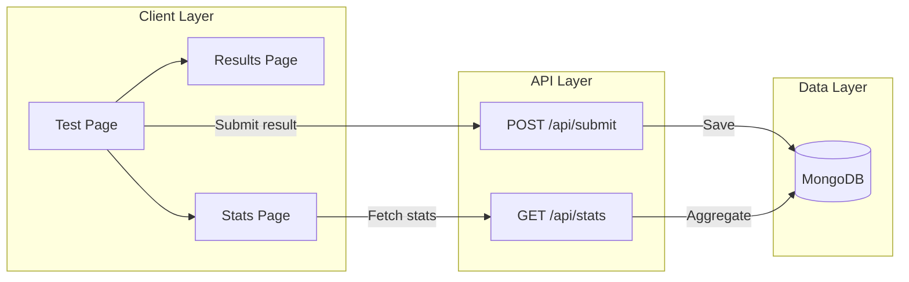

The SJSU Purity Test is built as a modern Next.js application using the App Router pattern. The architecture follows a client-server split where interactive components run on the client, while data persistence and aggregation happen through serverless API routes.

## Overview

The application follows a three-tier architecture:

1. **Client Layer** — React components with `'use client'` directive handle all user interactions
2. **API Layer** — Next.js API routes act as serverless functions for data operations
3. **Data Layer** — MongoDB stores test results and powers aggregate statistics



## File Structure

```
src/
  app/
    page.tsx              # Main test UI (client component)
    layout.tsx            # Root layout
    globals.css           # Global styles
    favicon.ico
    icon.png
    results/
      page.tsx            # Results page (client component)
    stats/
      page.tsx            # Statistics page (client component)
    api/
      submit/
        route.ts          # POST /api/submit — saves result to MongoDB
      stats/
        route.ts          # GET /api/stats — aggregates stats from MongoDB
  lib/
    mongodb.ts            # MongoDB connection utility with caching
    models/
      TestResult.ts       # Mongoose model for test results
public/
  sjsuricepurity.png      # Header logo image
  x.png                   # X (Twitter) logo
```

## Request Flow

<Steps>
  <Step title="User takes the test">
    User opens the app at `/` — Next.js renders the test UI as a client component. The 100 questions are displayed with checkboxes.
  </Step>

  <Step title="Score calculation">
    User clicks "Calculate My Score" — the score is computed entirely client-side:

    ```typescript
    const score = Math.round(((100 - checkedCount) / 100) * 100);
    ```
  </Step>

  <Step title="Result submission">
    The client calls `POST /api/submit` with the score and answers array:

    ```typescript
    const response = await fetch('/api/submit', {
      method: 'POST',
      headers: { 'Content-Type': 'application/json' },
      body: JSON.stringify({ score, answers }),
    });
    ```

    The API route saves the result to MongoDB.
  </Step>

  <Step title="Redirect to results">
    Regardless of API success or failure, the user is redirected to `/results?score=${score}`. This resilience ensures users always see their score even if the database is unavailable.
  </Step>

  <Step title="Statistics aggregation">
    The `/stats` page fetches `GET /api/stats` which runs MongoDB aggregation queries to calculate community statistics.
  </Step>
</Steps>

## Key Architectural Decisions

### Client Components for Interactivity

All three pages (`page.tsx`, `results/page.tsx`, `stats/page.tsx`) use the `'use client'` directive. This is necessary because they use React hooks for state management and browser APIs:

- `page.tsx` — Manages checkbox state for 100 questions
- `results/page.tsx` — Reads URL parameters and handles sharing
- `stats/page.tsx` — Fetches and displays aggregate data

### API Routes as Serverless Functions

Next.js API routes (`api/submit/route.ts`, `api/stats/route.ts`) run as serverless functions on Vercel. Each route:

- Is an isolated function invocation
- Has no persistent server state
- Connects to MongoDB on each request

### Connection Caching for Serverless

The `mongodb.ts` utility implements a global connection cache to prevent creating multiple MongoDB connections during development hot-reloads and serverless function warm starts:

```typescript
const cached: MongooseConnection = globalWithMongoose.mongoose || {
  conn: null,
  promise: null,
};

async function connectDB(): Promise<typeof mongoose> {
  if (cached.conn) {
    return cached.conn;
  }
  if (!cached.promise) {
    cached.promise = mongoose.connect(MONGODB_URI, { bufferCommands: false });
  }
  cached.conn = await cached.promise;
  return cached.conn;
}
```

<Tip>
  Without connection caching, each hot module replacement in development would create a new MongoDB connection, quickly exhausting your connection pool. In production serverless environments, caching improves response times for warm invocations.
</Tip>

### Client-Side Score Calculation

The purity score is calculated entirely in the browser. This design choice provides several benefits:

- **Resilience** — Users always see their score even if the API fails
- **Performance** — No network round-trip required for calculation
- **Privacy** — Answers are only sent to the server if the user submits

<Note>
  The answers array is submitted along with the score for aggregate statistics, but the score displayed to the user is computed locally and never depends on the API response.
</Note>
